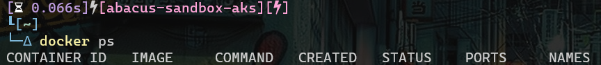
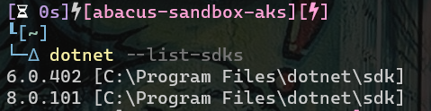
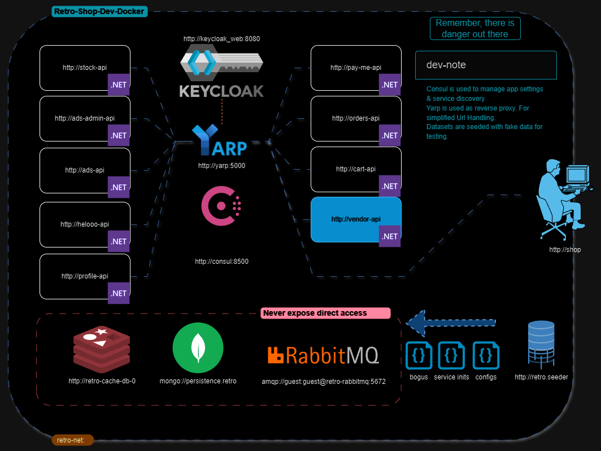

# WELCOME! To the Agile Bridge dotnet training day

Here is where you'll put into practice what we've learned so far. 

## Setting up your environment

Here are the following things you need to effectively run the solution.

1. Docker, download & install docker from [here](https://desktop.docker.com/win/main/arm64/Docker%20Desktop%20Installer.exe?utm_location=module). _Note!_ You don't have to choose a paid version, just standard docker desktop and you're good to go.
   1. To validate your docker installation, open the docker desktop application (most likely after a restart)
   2. run the following command in your terminal
      1. ```docker ps```
      2. 
      3. This command should run successfully without any incident or error message.
2. Dotnet 8. Run the following command in your terminal
   1. ```dotnet --list-sdks```
   2. 
   3. make sure you have 8.x.xxx installed for this exercise
   4. Install dotnet 8 sdk from [here](https://dotnet.microsoft.com/en-us/download/dotnet/thank-you/sdk-8.0.405-windows-x64-installer).
3. Bruno API Client, download and install from [here](https://github.com/usebruno/bruno/releases/download/v1.38.1/bruno_1.38.1_x64_win.exe).
4. Your default IDE

## Business Proposition

Our primary source of income is in the sales of retro games, to that effect we've developed a store that would service our clients needs for any retro gaming fix. 

We've charged the agile bridge with this development task using cloud native technologies so that we can leverage scalable, reliable, secure and performant transactions for our clients.

We want our store to become the premier store in the world to buy your retro games.

## Our Solution Overview



### Important Links
* [Consul](http://localhost:8500)
* [Retro-Shop](http://localhost:5001)
* [Keycloak](http://localhost:8080)
* [Swagger-Pages](http://localhost:*/swagger/index.html)

### Shop Services
* [hellooo-api](http://localhost:5000/hellooo-api/swagger/index.html)
* [ads-api](http://localhost:5000/ads-api/swagger/index.html)
* [ads-admin-api](http://localhost:5000/ads-admin-api/swagger/index.html)
* [stock-api](http://localhost:5000/stock-api/swagger/index.html)
* [retro-payments](http://localhost:5000/retro-payments/swagger/index.html)
* [cart-api](http://localhost:5000/cart-api/swagger/index.html)
* [pay-me-api](http://localhost:5000/pay-me-api/swagger/index.html)
* [orders-api](http://localhost:5000/orders-api/swagger/index.html)
* [profile-api](http://localhost:5000/profile-api/swagger/index.html)

## How to run
1. Clone the repo
2. Open terminal in the root directory (works best with WSL terminal)
   1. wsl: `cd /mnt/{drive-letter}/{path-to-repo}` & `docker-compose up -d`
3. Run `docker-compose up -d` to start the services
4. Open `http://localhost:8500` to see the consul dashboard

## How to stop
1. Open terminal in the root directory
2. Run `docker-compose down -v` to stop the services
   > [!NOTE]  
   > The `-v` flag is used to remove the volumes as well if you want to keep your data, remove `-v`

## How to use compose in development
1. Open terminal in the root directory
2. Run `docker-compose build` to build the services
3. Run `docker-compose up -d` to start the services
4. If you make changes to the code, you can run `docker-compose up -d --build` to rebuild the services
5. Open `http://localhost:8500` to see the consul dashboard
6. Run `docker-compose down -v` to stop the services

